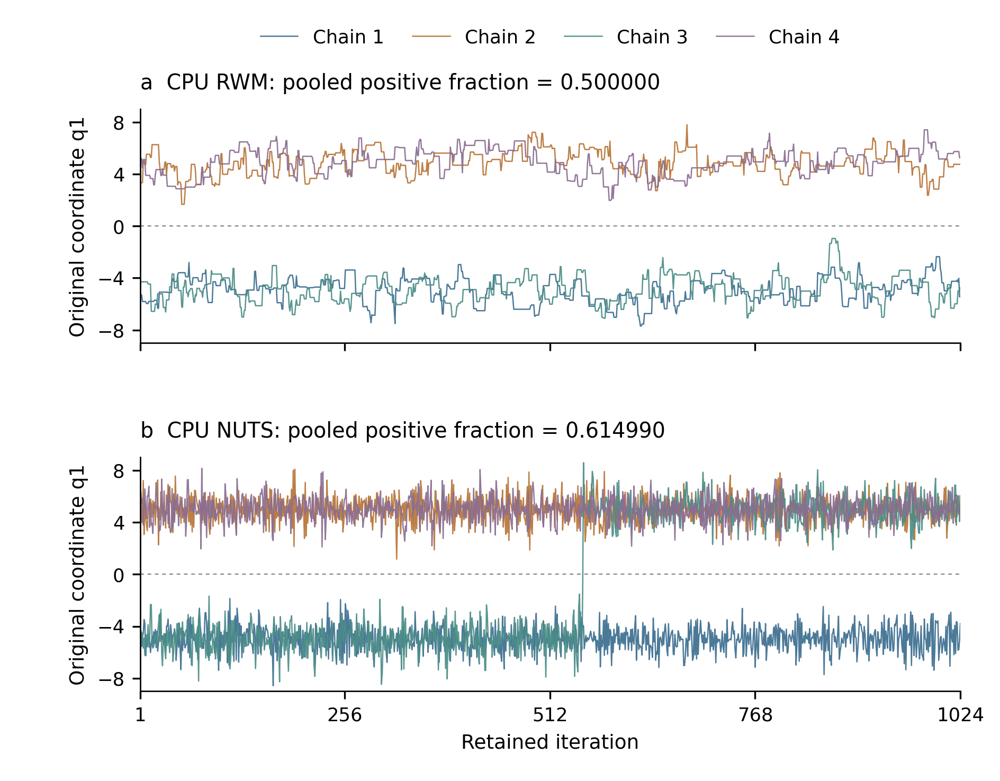

# 双峰目标：合并估计与单链探索的原始路径对照

2026-10-10。采用 nature-statistics 的单位/解释审查与 nature-figure 的Python绘图、字体和视觉核验。此伴随分析在看到正式汇总后提出，读取完整M1原件，不新增采样，不改变正式函数、阈值、区间规则或重复数。九目标全量NumPy/R重建仍在进行。

## 检查什么

遍历M1全部432个计划任务。原状态、request/capsule、完成绑定、输入、fit、原始函数二进制和均值文件逐项与外部清单SHA核对。412份有效拟合读取原参数第一坐标；20份未分类NUTS失败保留，部分链没有当作完整拟合加入。

每份有效拟合四条链：先检查实际初值，再检查全部已保存MH丢弃段或NUTS预热段，以及保留段。穿越定义为相邻保存状态的指标 `q1 > 0` 发生变化，零归入非正侧；不是HMC积分器内部未保存位置的穿越计数。保留段指标与原先R输入中的符号函数逐点相同，其四链均值与原估计相同。坐标映射在该目标为恒等，初值与输出可直接对应。

## 结果及其含义

- 384份MH有效拟合（1536条保存链）没有观察到符号穿越，所有合并正侧比例恰为0.5。
- 28份有效NUTS拟合（112条保存链）中，一份1024步任务发生一次穿越；其余27份无穿越。长预算20份失败不包含在这28份中。
- 共412份有效拟合，411份的正侧比例恰为0.5，另一份为0.614990234375。全部初值均为两条负侧、两条正侧；在没有穿越时，等长合并轨迹的0.5由这一配置直接确定。

因此，在该对称目标和预设初值下，符号函数的经验平方误差可以为零，而每条保存链始终停留在同一侧。这个结果限制的是“由一个正确合并估计推断单链充分探索”的论证。它不证明所有合并估计都不准确：已知正确模式权重时，分层估计在满足相应条件后也可能有效；本研究未以此替代普通MCMC的不确定性和诊断规则。

唯一穿越来自原重复编号5的CPU NUTS、保留1024步，第三条链由负侧转为正侧，正侧占其保留步的0.4599609375。不能用此单例判断NUTS优劣，也不能把其他411份较小符号误差当作更充分探索的证据。正式逐函数结果、退化区间、链间诊断和失败分母继续各自保留。

1648条链和两个预算/九个工作流是检查数量，不能当作1648个独立重复。原单位仍为每目标24份四链输入；同核执行和跨设备重用输入不增加n。

## 图件与选择规则

图中展示唯一出现穿越的NUTS任务，以及同一重复、同一1024预算的CPU顺序RWM任务。两者共享预设初值，采样随机机制不同；不是同核固定随机数组对照。只画保留段，各条已保存状态均保留，无插值、平滑或删点。上图合并正侧比例为0.5，下图为0.614990；图用于解释现象，不是基于两条工作流的新性能检验。全432项的计数依据上文完整审查，不从示例外推。

主图物理宽160mm、高125mm，最小字8.5pt；PDF/SVG可编辑，PNG为300dpi预览。首次导出的末端刻度裁边已修正，失败QA保留。最终对齐、字体及碰撞检查通过，两个面板和整图已审读。

## 重建与证据

源码为 `scripts/analysis/review_mixture_paths.py` 和 `plot_mixture_example.py`；前者要求完整432任务及外部清单SHA，后者另要求伴随SUMMARY/tasks的独立SHA，按唯一例外及同重复规则选择。全部原始图数据8192行在 `figures/compact-mixture-companion-v1/source.csv`，原件来源SHA在图件契约和完整审查SUMMARY中。

四项行为检查通过（0失败/跳过），分别验证：两侧停留可以产生零合并损失；初始/预热穿越与保留段穿越分开；原函数不一致时拒绝；非有限或空保留段拒绝。完整原件运行通过，但不据此关闭其他目标的路径与现代诊断重建。

证据目录：`benchmark/analysis/outputs/compact-mixture-path-companion-v1`。最终论文将结合全量重建的误差/诊断/成本整合此解释，既不把单个误差阈值当收敛证明，也不因不跨峰就否定全部已测函数的估计准确性。
