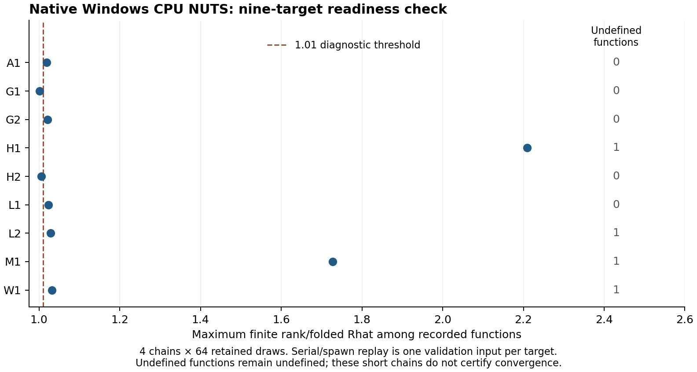

# Windows 第二轮核验回执（2026-10-05）

本轮在独立分支 `codex/windows-completion-v2` 执行 F1、水井 F4、九目标 CPU NUTS、
CPU/CUDA MH；这些已执行核验通过。F2 机制 pilot 在输入校验处阻塞，192 个工作流未启动。
没有执行尚未冻结的正式推断网格，也没有重跑历史 512 项任务。

执行源码提交为 `f5148ee39868a657809f400bf1755d083c744fc8`，与交接远端一致。
每项协议仍保留其原冻结源码提交和逐文件哈希；本分支新增的记录、分析和图表脚本不改变
采样核心。原工作区、冻结 venv、旧协议及原始结果均保留。

## 环境和实际状态

Windows 11 build 26200，AMD Ryzen 7 9800X3D，RTX 5080（sm_120），驱动 616.56；
Python 3.12.14 x64，torch 2.13.0+cu130、NumPy 2.2.6、SciPy 1.15.3、Pyro 1.9.2；
R 4.6.1/ucrt、posterior 1.7.0。复用 `D:/workspace/ParallelBayes/.venv-win-torch`，
R 位于 `D:/Tools/R-4.6.1`，库位于 `D:/Tools/R-library-4.6`。没有安装或升级冻结环境。
完整版本、pip freeze/check、nvidia-smi 和源码核验见
[小型证据目录](../benchmark/analysis/outputs/windows-completion-v2/)；每条执行命令有独立日志及退出码。

| 阶段 | 完成／失败／待执行 | 实际证据 |
|---|---|---|
| F1 | 固定样例通过 | 原生中心 `0x1.7701bac434f11p-10`；Rhat 1.40822237244096；降低一个 ULP 后 1.40856883690538，5 个秩改变；12KiB 二进制回写一致 |
| F2 | 0／输入准备失败／192 工作流 | 六份重建实际数组哈希均不符；采样前拒绝，原错误和全部重建数组保留 |
| F4 | 12／0／0 个技术执行 | CPU、CUDA、R-CUDA 各 4；独立 NumPy、接受事件及 R 回传通过，最大路径差 <9.06e-11 |
| F3 CPU NUTS | 9／0／0 个目标 | 每目标顺序四链与四个原生 spawn 工作进程，六类数组逐字节一致；18 份 R 诊断回写一致 |
| F3 CPU MH | 54／0／0 工作流 | 9 目标、36 组顺序/时间执行配对通过，54 份保存数组独立 NumPy 重放通过 |
| F3 CUDA MH | 54／0／0 工作流 | 同上，真实设备 `cuda:0`；无 CPU 替代 |

F2/F4 前置测试最终为 **5 通过、1 跳过**（跳过非 Windows 拒绝测试）；Windows msvcrt
互斥实测通过。初次测试的 3 个 setup errors 来自旧 pytest 临时目录拒绝访问；日志保留，
重试仅指定本轮新临时目录。NUTS 和 MH 前置测试各 **3 通过、0 跳过**，MH 的 CUDA 案例实际执行。
这些计数独立于历史 65/63，不相加。

## 核验结果及不利诊断

NUTS 的六类数组包括保留/无约束样本、预热状态、初始和最终 torch 随机状态以及初值。
记录了每个目标的四个真实 PID、单 worker 线程和进程元数据。每目标仅一份验证输入；
串行/多进程为配对技术执行，不是 18 份独立统计重复，更不与 MH 声称相同轨迹。

七个目标至少一个有限 Rhat >1.01；H1 最大 2.20891，M1 最大 1.72796。
L2/H1/M1/W1 各有一个不可判定函数；NA 原样保留。各目标两种执行的已报告发散数均为 0，
但完整树深命中次数未由 Pyro 提供，保留 null。64 步短链和零发散均不构成收敛或精度证明。

MH 的 H1/MALA 第三条链在 CPU/CUDA 的顺序、窗口 8 和窗口 32 执行中均全拒绝；
六条记录是同一输入的配对执行，不能计作六次独立事件。独立坐标行列式核验最大差
2.85e-14，本机未出现该核验中的 slogdet 警告；torch.jit 弃用警告仍保留。
额外只读核对 54 组 CPU/CUDA 保存数组：接受事件零失配、最大路径及约束输出差
1.084e-12，全部通过沿用的路径容差。没有据这些单次验证制作速度排名。

水井保持原平坦先验、dist/100 和参数顺序。Rhat 为 3.0360／3.8170，明确仅为目标、
路径和传输核验。既有有限参考、稀有事件及积分不确定性不由本次短链重新解释。

所有目标终态后实际执行 `--resume`：NUTS 新增目标 0，126 个终态文件不变；
CPU/CUDA MH 各新增目标 0、各 135 个终态文件不变。恢复前 summary 和逐文件哈希、
恢复调用及回执一并保存。各次审计引用的恢复前 summary 哈希可由保存副本对应核验。

## F2 输入阻塞和恢复要求

协议 `mechanism-windows-pilot-v1` 的规范身份仍为
`9d8985f579a64df95ebbb22ce0a607020261e5a66516efc80edcf9c956894b2c`。
Windows 同版 NumPy 重建的 `G1-r0/r1`、`G2-r0/r1`、`L1-r0/r1` 六份实际数组组合哈希
均与冻结值不符。仓库只提供这些哈希，没有原始六份 NPZ；没有把同 seed 当作相同随机数组。
没有原数组时不能将差异归因于特定分量或数值库。

需取得冻结时的上述六份 `.npz`，先核对协议中的 `file_sha256` 与 `actual_sha256`，
再执行交接已有的 CPU/CUDA 命令。被拒绝的候选数组只用于排错，位于归档内
`mechanism-rejected-inputs/`，不能作为该协议输入。未改哈希、协议、算法或环境放行，
也未另起未经冻结的正式网格。

## 复核和回传

全部原始数组、预热、实际随机状态、子进程记录、R 二进制往返、失败、环境、
命令日志和恢复检查保存在 `output/completion/windows-round2-20261005`。
小型证据的 `SHA256.json` 覆盖其全部记录文件；图表脚本读取保存的诊断 CSV。
完整结果包另用既有 `export_results.py` 创建，以 `verify-windows-return.py` 逐成员核验，
包含六份协议、共同输入和完整源码 Git bundle；最终 tar 自身哈希与核验回执置于包旁。
开发分支推送和大包使用新的草稿 Release，历史资产不变。

主要实际命令可从小型证据 `commands/*/receipt.json` 原样取得。新增工具职责为：

- `scripts/run_windows_completion_step.py`：记录独立命令和环境，不改变协议。
- `scripts/check_windows_completion_evidence.py`：保留输入失配、快照与恢复前后比较。
- `scripts/summarize_windows_completion.py`：只读汇总、跨设备保存数组比较。
- `scripts/plot_windows_completion.py`：从保存 CSV 生成 PNG/SVG/PDF。

私有技能包 `parallelbayes-user-skills-2026-10-04.zip` 仍未收到，迁移未标完成；
包中不含私有技能、凭证或环境目录。GPU NUTS、原生 Stan 编译、融合设备控制、
F3 正式推断、F5 发布整合和 F6 稿件整体重构均未由本轮验收。
