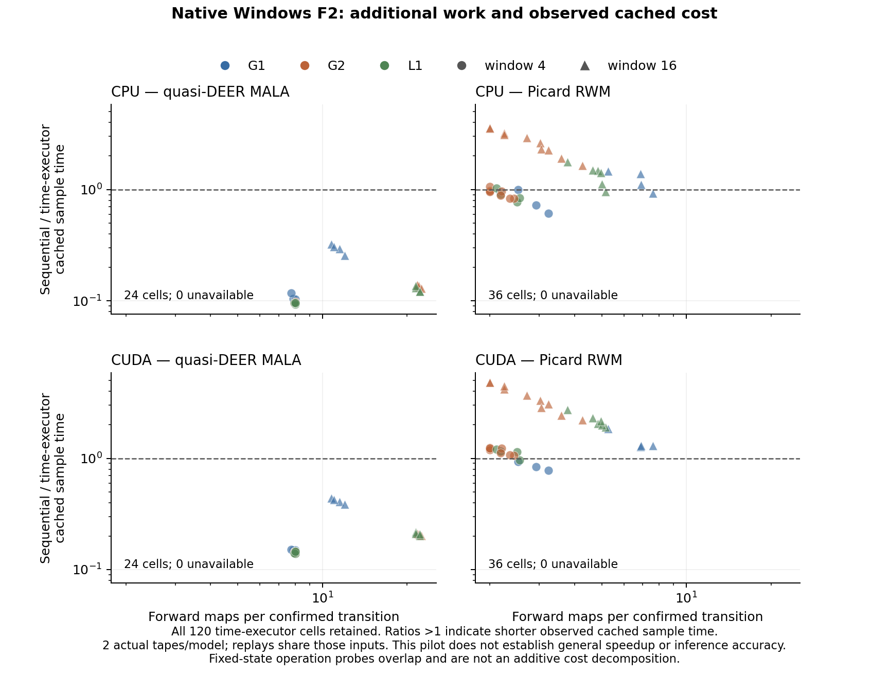

# 原始冻结输入的 Windows F2 机制 pilot 回执

2026-10-06。原生 Windows CPU/CUDA 共 **72 组、192 个工作流全部完成数值核验**，
失败和待执行均为 0。输入阻塞由取得原始六份 NPZ 解决；旧重建失败和候选数组保留。
本回执只关闭该有限 F2 pilot 的执行和回传，不关闭正式推断或整个研究。

## 身份与环境

开发分支 `codex/windows-mechanism-completion`；实际执行 HEAD 为
`52fdfd0446768033ffd975bc52ea8036c420880d`。冻结源码提交
`97e6835476bf71f48c1236e7cc77f235e5191d6c`，协议规范身份仍为
`9d8985f579a64df95ebbb22ce0a607020261e5a66516efc80edcf9c956894b2c`。
41 份冻结源码逐文件匹配。一个旧工作副本的 `reference.py` 为 CRLF，已保存旧字节，
恢复为其原 Git blob 的 LF；实现、协议和容差没有变化。

沿用 `D:/workspace/ParallelBayes/.venv-win-torch/Scripts/python.exe`：Python 3.12.14 x64、
torch 2.13.0+cu130、NumPy 2.2.6、SciPy 1.15.3。完整分发版本和原冻结标记在执行前、
汇总时均一致。Windows 11 build 26200、Ryzen 7 9800X3D（8 物理/16 逻辑 CPU）、
RTX 5080 sm_120、驱动 616.56；torch CUDA build 13.0，nvidia-smi 报 UMD 13.4，
二者分别记录。全部 CUDA 首次审计记录为 `cuda:0` / `torch.float64`。
两端 torch 主机线程数均为 4；进程线程包含库和驱动线程，首次调用记录为 CPU 42–50、
CUDA 40–47。机器有桌面显示负载，不声称独占物理资源。

原输入从现有草稿 `windows-completion-v2-20261005` 下载，tar 为 10,823,680 字节，
SHA256 `2b46eedc58067c920c8519cb4f99965bf944202f57392514d4643b847f9b9e5a`。
包内恰为六个普通文件，各 NPZ 文件及实际数组双重哈希吻合。与旧候选复核：
仅 82 个 log_uniform 末位不同，最大差 4.44e-16；noise/directions 一致。
没有按种子重建、取整或修改哈希。

## 完整状态与路径核验

| 实际设备 | 组完成/失败/待执行 | 工作流完成/失败/待执行 | 五阶段技术调用 | 时间/顺序配对 | 操作探针 |
|---|---|---|---|---|---|
| CPU | 36/0/0 | 96/0/0 | 480/480 通过 | 60/60 通过 | 64/64 通过 |
| CUDA | 36/0/0 | 96/0/0 | 480/480 通过 | 60/60 通过 | 64/64 通过 |

五阶段为首次独立 NumPy 审计、3 次交错缓存重放、探针后重放。每个工作流的路径和接受
事件在同设备各次重放中逐字节相同。各组输入前缀由修复后的分析器显式读取原主文件核对。
每端配对和独立 oracle 的最大路径差均小于 3.845e-10，接受事件差为 0。
补充只读核对全部 96 组 CPU/CUDA 保存数组，接受事件差为 0，路径/约束输出最大差
8.882e-15，全部通过原配对门槛 1e-7。

新接口/运行器测试 **5 通过、0 失败、0 错误、0 跳过**；18 条 torch.jit 弃用警告保留。
测试计数独立于 192 科学工作流和既有 65/63 等历史计数。没有重跑 F1、水井、NUTS/MH
就绪核验或历史 512 项网格。

终态后分别实际执行一次 `--resume`：新增组/尝试均为 0，各 1360 个终态文件逐字节
不变，原 summary 和运行时身份亦不变。冻结运行器不直接输出新增组计数，这里依据
实际恢复调用、完整终态目录快照以及没有新增 attempt 目录核验。该证据仅为终态跳过，
不冒充中断恢复或 Windows 进程集合/长期资源保护。

## 描述性成本与保留的负结果

下表比值为同组顺序执行的三次缓存 sample 时间中位数除以时间执行器中位数。
比值 >1 表示本次缓存调用较短；不是完整普通推断或研究审计加速。

| 设备/核 | 时间执行配置数 | 比值 >1 的配置 | 全部比值范围 |
|---|---|---|---|
| CPU quasi-DEER/MALA | 24 | 0 | 0.0924–0.3218 |
| CUDA quasi-DEER/MALA | 24 | 0 | 0.1386–0.4368 |
| CPU Picard/RWM | 36 | 20 | 0.6120–3.5743 |
| CUDA Picard/RWM | 36 | 32 | 0.7776–4.8047 |

两端 quasi-DEER 所有配置均较慢，全部保留；Picard 的减速配置也保留。
每端 6 个工作流完全零接受，另有共 21 条全拒绝链记录（窗口/执行器复用同一输入，
这些不是 21 次独立事件）。G2/RWM 步长 1.0、第一份输入的窗口 4/16 确认前缀为
4/16，同时零接受；长前缀和低缓存成本不证明探索充分。步长 0.25 的预设对照及
1/4/16 链等 512 输出分配均完整保留，没有按结果调整。



| 记录口径 | CPU | CUDA |
|---|---|---|
| 首次审计的确认转移总数（含拒绝自环） | 33,024 | 33,024 |
| 首次审计前向映射 / JVP 总数 | 158,430 / 51,072 | 158,430 / 51,072 |
| 每工作流缓存 sample 中位数范围（秒） | 0.00641–1.71824 | 0.01937–2.95635 |
| 每工作流缓存 API 墙钟中位数范围（秒） | 0.00813–1.71956 | 0.02212–2.95801 |
| 缓存主机标量等待中位数范围（秒） | 0.0000052–0.0014512 | 0.0000540–0.0304202 |
| 缓存 process CPU 百分比中位数范围 | 0–727.0% | 125.1–248.5% |
| RSS 端点范围（字节） | 596,074,496–692,002,816 | 695,238,656–1,520,869,376 |

短调用的 process CPU 时间有计时分辨率，0 不表示没有主机工作，百分比可超过 100%；
它不是 GPU 利用率或独占核心计数。CUDA 保存采样调用的分配器 peak allocated 最大
69,153,792 字节、peak reserved 最大 71,303,168 字节；它们不覆盖全进程/操作探针峰值，
CPU RSS 也只是端点。完整记录有逐轮前缀、残差、裁剪、同步等待、输入/传输/审计/变换、
归档和停止原因；本次首次执行的 fallback/状态修复均为 0。Picard 的确认前缀规则与
quasi-DEER 的残差停止规则分别保留，不对不同停止规则套用同一个残差指标。

记录器的完整设备运行墙钟为 CPU 258.687 秒、CUDA 494.402 秒，包含检查、五阶段调用、
探针及封存，首次审计并非全新进程冷启动。它不同于缓存 sample 时间，也不是 F3 的
正式推断费用。固定状态探针的操作重叠，不相加或相减制造独占成本分解。

每模型只有两份独立主输入；三次缓存重放和探针后重放不增加独立 n。图表列出全部
120 个时间执行配置，不输出一般加速、稳定排序、收敛或精确达标时间声明。

## 复核和交付

完整原始批次为 `output/completion/windows-mechanism-original-attempt01/`，含六份原输入、
两个设备全部尝试/数组、环境、命令及错误、恢复前快照、源码字节快照和完整 Git bundle。
旧第二轮失败上下文另存 `prior-second-round/`；原旧目录和包未改变。
小型回执和 CSV 在
[`benchmark/analysis/outputs/mechanism-windows-pilot-v1/windows-20261006/`](../benchmark/analysis/outputs/mechanism-windows-pilot-v1/windows-20261006/)，
已复核 2648 个原任务资产和 143 个小型文件。末次图表检查修正了纵轴标签重叠，
原图及源代码保留在原始批次 `figure-attempt01/`，分析数值不变。

关键实际命令（从项目根、相同冻结解释器执行）为：

```powershell
$PB_PYTHON = 'D:/workspace/ParallelBayes/.venv-win-torch/Scripts/python.exe'
$PB_PLAN = 'benchmark/protocols/mechanism-windows-pilot-v1.json'
$PB_BATCH = 'output/completion/windows-mechanism-original-attempt01'
$PB_INPUTS = "$PB_BATCH/original-inputs"
& $PB_PYTHON scripts/completion/mechanism_runner.py prepare --plan $PB_PLAN --inputs $PB_INPUTS
& $PB_PYTHON scripts/completion/mechanism_runner.py run --plan $PB_PLAN --inputs $PB_INPUTS --output "$PB_BATCH/mechanism-cpu" --device cpu
& $PB_PYTHON scripts/completion/analyze_mechanism_pilot.py --plan $PB_PLAN --inputs $PB_INPUTS --run "$PB_BATCH/mechanism-cpu" --output "$PB_BATCH/analysis-cpu"
& $PB_PYTHON scripts/completion/mechanism_runner.py run --plan $PB_PLAN --inputs $PB_INPUTS --output "$PB_BATCH/mechanism-cuda" --device cuda
& $PB_PYTHON scripts/completion/analyze_mechanism_pilot.py --plan $PB_PLAN --inputs $PB_INPUTS --run "$PB_BATCH/mechanism-cuda" --output "$PB_BATCH/analysis-cuda"
```

上述目录已有终态，不能重复首次执行/覆盖分析；原命令及 `--resume` 调用、时间、PID、
退出码和日志哈希见各 `commands/*/receipt.json`。新记录器显式接收 `--batch`。
新增只读汇总、恢复检查及图表脚本不改变冻结采样器。完整结果用既有 `export_results.py`
导出并由 `verify-windows-return.py` 逐成员核验，最终 tar 自身校验和与核验回执在包旁；
推送独立开发分支，归档作为现有草稿的新附件，保留原有资产且保持草稿。

F3 正式推断、Windows 长期任务进程集合/资源保护与最大任务、F5 两平台干净安装及
F6 最终论文仍为后续门槛。尚未冻结的正式网格未启动；选择器和融合 CUDA 控制未新增。
