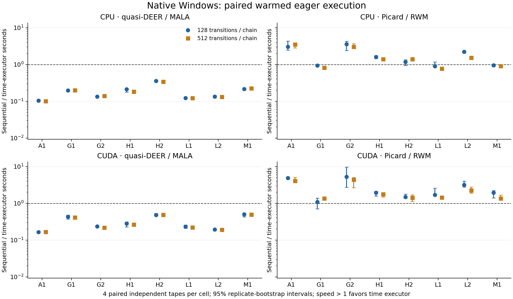

# 原生 Windows 本轮交付记录

2026-10-04；独立分支 `windows-native-dev`，Python 开发版本 `0.2.0.dev1`。
本轮完成真实 RTX 5080 float64 运算、可替换 torch 数值模块、两条时间执行路线、R 批量入口及冻结实验。
历史 Mac 的 1920 主任务、320 SBC、72 机制任务、全部负结果和旧源码/协议未改写。

## 实验身份和计算核验

科学源码提交为 `0c9325e98f2bc7dcd75d344c01c2e50a62801c90`；冻结协议为
[`windows-native-v1`](../benchmark/protocols/windows-native-v1.json)，身份 SHA256 为
`1d233dd09956c4575fc5775082310e5edca65407db5fcef40bc2ce329e6f5898`。
这是规范 JSON 内容身份；文件字节哈希另由归档清单记录，二者不应混淆。

环境为 Windows 11、Ryzen 7 9800X3D、RTX 5080（sm_120）、驱动 616.56、
Python 3.12.14 x64、torch 2.13.0+cu130。Python 虚拟环境位于项目的
`.venv-win-torch`，R 4.6.1 及 R 库位于 `D:\Tools`。
由于签名有效的 Python 3.12.10 MSI 安装失败，使用现有原生 3.12.14 解释器建立独立 venv，失败日志保留。
无需驱动变更、重启、CUDA Toolkit、VS 或 Rtools。

正式设计为 8 个模型 × 2 个预算（128/512）× 4 份独立随机数组 × CPU/CUDA × 4 个 MH 工作流，共 512 项。
每项 4 链，窗口 16，丢弃前 1/4；随机数组在同模型/预算/重复的配对执行间共享。
所有任务通过预定数值检查；256 项实际使用 CUDA 张量。没有自动回退，没有终结失败，没有事后删除任务。

| 核验 | 实测结果 |
|---|---:|
| 独立 NumPy oracle 接受事件失配 | 0 |
| 独立 oracle 最大无约束路径差 | 5.2116 × 10⁻¹⁰ |
| CPU/CUDA 实际数组配对 | 256 对 |
| CPU/CUDA 最大无约束路径差 | 2.8422 × 10⁻¹⁴ |
| CPU/CUDA 最大约束输出差 | 5.6844 × 10⁻¹³ |
| CPU/CUDA 接受事件失配、非有限输出 | 均为 0 |

密度、梯度、所需 JVP、Jacobian 和变换、接受临界值、仿射扫描次序、窗口末端、前缀、拒绝自环、
迭代耗尽、内存守卫、注入错误与原数组回放均有测试。CPU 65 项、CUDA 63 项通过；
72 项原始路径核验、8 个 R 批量/次序核验通过。单独 JAX 环境的 51 项回归通过，
7 项 Stan 编译测试未运行；交接工具 17 通过、1 项平台跳过。
起初两个错误边界测试断言、安装失败和后续分析脚本修复的日志均保留。

## 执行速度与推断限制

下表为各模型/预算组的中位速度比范围，定义为同设备同核的顺序耗时除以时间执行器耗时。
每组 4 份独立数组；每份数组的两次 warmed eager 重放仅为技术重复。

| 设备/方法 | warmed 执行 | 普通推断 API | 独立核验 API |
|---|---:|---:|---:|
| CPU quasi-DEER/MALA | 0.101–0.359 | 0.102–0.369 | 0.118–0.387 |
| CPU Picard/RWM | 0.774–3.560 | 0.814–3.128 | 0.827–2.294 |
| CUDA quasi-DEER/MALA | 0.164–0.505 | 0.177–0.517 | 0.180–0.544 |
| CUDA Picard/RWM | 1.097–5.230 | 1.316–4.749 | 1.222–3.545 |

quasi-DEER 的所有组中位结果都更慢。CUDA Picard 的 16 个组中位数均大于 1，
其中 15 组的 warmed 逐点 bootstrap 区间下限大于 1；仅 4 次独立重复，不能外推为稳定普遍加速。
**A1/RWM 的全部 32 次拟合接受次数为零：它们测到的是拒绝自环执行，不能作为有效后验探索的加速案例。**

图中误差线为重复层面 2000 次 bootstrap 的逐点 95% 区间，不是同时置信保证。
A1/RWM 的点包含上述全拒绝轨迹；没有将其从图中删除。
GPU 张量驻留已核验，但控制仍由 Python eager 循环驱动，不宣称已实现高效设备内控制流。

480/512 次拟合至少有一个有限 rank/folded Rhat > 1.01；108 次拟合含常量变量/函数。
最大有限 Rhat 为 4.666，最小有限 bulk/tail ESS 为 4.085/4.205。
常量诊断保留为不可判定；Rhat 计数仅为事后描述，没有改写冻结验收标准。
因此，512 个数值完成任务不代表 512 次可靠推断。解析目标的逐函数重复 MSE 和不确定性已保存，
L1/L2 参考仍未确定。没有把短链 ESS 当成真实重复误差，也没有用两个预算推算精确达标时间。

小型 SBC 的统计重复单位为 12 个新数据集，每个数据集共享于 5 个工作流，共 60 次拟合。
五个工作流及同数据解析 90% 区间均覆盖 9/12，覆盖判定没有分歧；解析覆盖的 95% 区间为 [0.428, 0.945]。
MALA、RWM、Pyro CPU NUTS 的均值 RMSE 分别约 0.01173、0.01304、0.00969；
两个区间端点及标准差误差也独立保存。共享数据不能算作 60 份独立校准证据。

## 成本与可复核资料

记录的正式任务总成本为 1790.220 秒，包含普通执行与技术重放；现代 R 诊断另计 28.470 秒。
普通 API 时间包括建模、输入、采样、变换及基本矩，不含写盘和 R 诊断。
独立核验 API 时间另含 NumPy oracle，也不含写盘和 R 诊断；不能把它们都称为完整研究耗时。
每项的映射/JVP 次数、求解轮数、残差、裁剪、确认前缀、输入/输出/传输/核验成本均在原始 JSON 中。

CUDA 分配/保留峰值分别为 97,251,328 / 115,343,360 字节，包含已有驻留分配。
CPU 未测逐拟合 RSS 峰值，仅记录数组空间估算。
初次审计执行累计 88,406 次主机标量读取，其等待计时共 4.206 秒；计时含设备等待，并非全部 Python 开销的分解。
共享 WDDM 桌面、Balanced 电源计划，没有宣称独占资源。

源码和环境冻结后未重装依赖。额外身份审计检查了 39 份科学源码、64 份输入文件、512 项输出、
Python/R 锁及冻结标记；恢复执行没有产生额外任务尝试。
试探阶段的配置合并误差区间已撤回，原结果和冻结哈希保留为 `summary.original.json`；正式重复分析不受影响。

主要入口：

- [环境、安装和实际命令](WINDOWS-NATIVE.md)
- [工作包状态](../execution/windows-native/WORK-PACKAGES.md)
- [数值、速度和诊断汇总](../benchmark/analysis/outputs/windows-native-v1/delivery-review.json)
- [完整正式分析及逐函数误差](../benchmark/analysis/outputs/windows-native-v1/summary.json)
- [技能状态](../execution/windows-native/skills-status.json)
- 原始数组、全部任务状态、试探/SBC/失败日志、源码快照及 SHA256 在 `output/windows-return` 结果包中。

尚未完成：私有 30 技能迁移（缺少 `downloads/parallelbayes-user-skills-2026-10-04.zip`，含 nature-shared），
原生 Stan 编译、GPU NUTS、融合设备内控制、扩大独立统计重复及外部真实模型验证。
Pyro CPU NUTS 仅核验 normal/Gaussian，预热计时桶多含首个保留转移；总时间有效，但未用于正式性能比较。
历史完整 CPU Release 未下载做旧随机数组回放，原始历史数据与身份保持不变。
稿件仅增加本轮真实证据；多文件中文 LaTeX 尚未重新编译，保留原 CPU PDF，不将其当作更新稿 PDF。
