# ParallelBayes：正式实验分析附件

固定预算下的已核验记录；失败、缺失与参考不确定性仍须参与解释。

本研究是旧采样启动后的资源修订；旧结果单独保留，未合入新重复。新正式研究为24次完整四链重复、1024/4096两个固定预算；缓存每格4份输入仅作描述，区间留空，失败不以成功子调用替代。

本报告从给定统计清单重建，没有重新采样、运行R诊断或估计新的区间。完整研究或后验收敛不由本报告自动判定。

统计清单 SHA256：`0c1857a7767ab5c8a117c00b75992db40c03c06e2453ad64c1398a64080a0c00`。

独立单位为一次完整四链重复。缓存使用预选原输入，每输入一次初始及三次准备后调用不增加独立重复数。
正式统计模式的误差及成本区间沿用9,999次共享整体重复重采样的逐点95% BCa区间，至少20个合格重复；不可判定保留原因，不补零宽区间。技术验收模式不生成这些正式区间。没有同时覆盖或多重比较校正的声明。
有限MCMC参考的MCSE与共享参考偏移敏感性另存；数值积分未认证，未定参考没有误差点。参考不确定性没有传播进BCa区间。
普通工作流、研究审计执行、额外核验和总调用分开记录，不累加嵌套时间。缓存执行比大于1不表示可靠推断加速。
CSV空单元表示不可用；完整状态与分母在同一行或对应JSON中。没有通过筛掉失败、常量函数、慢配置或未定参考来生成图件。

| 目标 | 计划主任务 | 计划缓存 | 主任务证据状态 | 缓存证据状态 |
|---|---:|---:|---|---|
| G1 | 432 | 64 | `{"analyzed": 432}` | `{"analyzed": 64}` |
| G2 | 432 | 64 | `{"analyzed": 432}` | `{"analyzed": 64}` |
| A1 | 432 | 0 | `{"analyzed": 432}` | `{}` |
| L1 | 432 | 0 | `{"analyzed": 432}` | `{}` |
| L2 | 432 | 64 | `{"analyzed": 432}` | `{"analyzed": 64}` |
| H1 | 432 | 0 | `{"analyzed": 432}` | `{}` |
| H2 | 432 | 0 | `{"analyzed": 432}` | `{}` |
| M1 | 432 | 0 | `{"analyzed": 432}` | `{}` |
| W1 | 432 | 64 | `{"analyzed": 432}` | `{"analyzed": 64}` |

所有来源表、可用性状态、逐任务费用及完整诊断见各模型子目录。图件是逐模型/函数的完整附件；正文主图选择须依据实际论证，不以获得有利结果为条件。

### G1 / execution costs

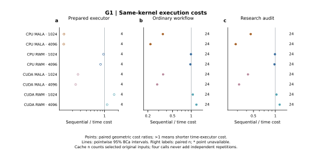

缓存每格4份预选输入，仅给描述性配对比，不生成区间；每输入初次及全部三次prepared调用均核验合格且计时齐全后才使用prepared中位数。普通工作流与含审计执行使用24次原始四链主任务的共同有效重复；至少20份时给逐点95% BCa区间，否则区间未定。点为共同合格输入上顺序/时间成本比的几何均值。RWM比较Online Picard，MALA比较quasi-DEER；缓存比不是普通后验推断加速。 空心标记表示区间不可判定；缺失点不补零。完整分母、缺失原因、参考类别及配对四格表见来源数据。

来源：[G1/ratios.csv](G1/ratios.csv)。

### G1 / standard_q1

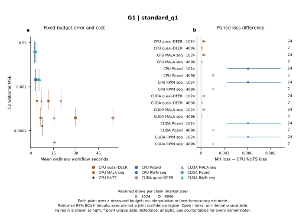

左图为各已测预算下的条件误差和同一函数可用重复上的普通成本。横纵区间分别为逐点95% BCa区间，不是联合置信区域。右图为共同有效重复上MH平方损失减CPU NUTS平方损失，零线不是显著性门槛。没有预算插值或精确达到精度时间的声明。 空心标记表示区间不可判定；缺失点不补零。完整分母、缺失原因、参考类别及配对四格表见来源数据。

来源：[G1/errors.csv](G1/errors.csv)。

### G1 / standard_q1_squared

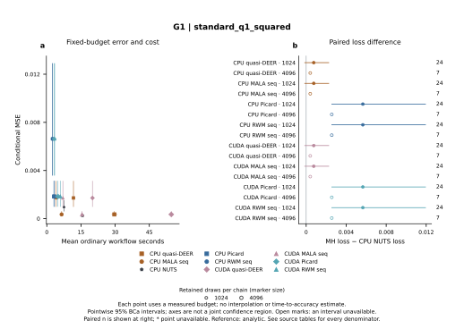

左图为各已测预算下的条件误差和同一函数可用重复上的普通成本。横纵区间分别为逐点95% BCa区间，不是联合置信区域。右图为共同有效重复上MH平方损失减CPU NUTS平方损失，零线不是显著性门槛。没有预算插值或精确达到精度时间的声明。 空心标记表示区间不可判定；缺失点不补零。完整分母、缺失原因、参考类别及配对四格表见来源数据。

来源：[G1/errors.csv](G1/errors.csv)。

### G1 / standard_q1_gt1

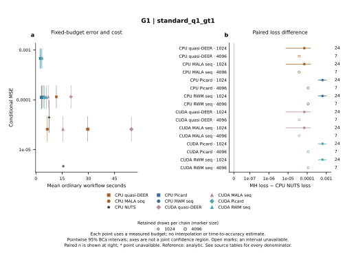

左图为各已测预算下的条件误差和同一函数可用重复上的普通成本。横纵区间分别为逐点95% BCa区间，不是联合置信区域。右图为共同有效重复上MH平方损失减CPU NUTS平方损失，零线不是显著性门槛。没有预算插值或精确达到精度时间的声明。 空心标记表示区间不可判定；缺失点不补零。完整分母、缺失原因、参考类别及配对四格表见来源数据。

来源：[G1/errors.csv](G1/errors.csv)。

### G2 / execution costs

缓存每格4份预选输入，仅给描述性配对比，不生成区间；每输入初次及全部三次prepared调用均核验合格且计时齐全后才使用prepared中位数。普通工作流与含审计执行使用24次原始四链主任务的共同有效重复；至少20份时给逐点95% BCa区间，否则区间未定。点为共同合格输入上顺序/时间成本比的几何均值。RWM比较Online Picard，MALA比较quasi-DEER；缓存比不是普通后验推断加速。 空心标记表示区间不可判定；缺失点不补零。完整分母、缺失原因、参考类别及配对四格表见来源数据。

来源：[G2/ratios.csv](G2/ratios.csv)。

### G2 / standard_q1

左图为各已测预算下的条件误差和同一函数可用重复上的普通成本。横纵区间分别为逐点95% BCa区间，不是联合置信区域。右图为共同有效重复上MH平方损失减CPU NUTS平方损失，零线不是显著性门槛。没有预算插值或精确达到精度时间的声明。 空心标记表示区间不可判定；缺失点不补零。完整分母、缺失原因、参考类别及配对四格表见来源数据。

来源：[G2/errors.csv](G2/errors.csv)。

### G2 / standard_q1_squared

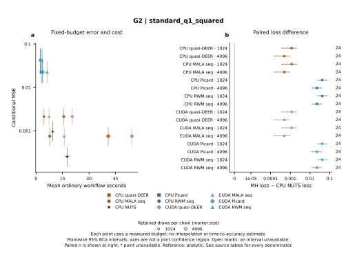

左图为各已测预算下的条件误差和同一函数可用重复上的普通成本。横纵区间分别为逐点95% BCa区间，不是联合置信区域。右图为共同有效重复上MH平方损失减CPU NUTS平方损失，零线不是显著性门槛。没有预算插值或精确达到精度时间的声明。 空心标记表示区间不可判定；缺失点不补零。完整分母、缺失原因、参考类别及配对四格表见来源数据。

来源：[G2/errors.csv](G2/errors.csv)。

### G2 / standard_q1_gt1

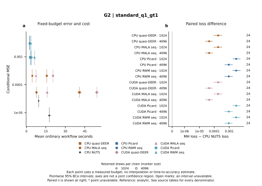

左图为各已测预算下的条件误差和同一函数可用重复上的普通成本。横纵区间分别为逐点95% BCa区间，不是联合置信区域。右图为共同有效重复上MH平方损失减CPU NUTS平方损失，零线不是显著性门槛。没有预算插值或精确达到精度时间的声明。 空心标记表示区间不可判定；缺失点不补零。完整分母、缺失原因、参考类别及配对四格表见来源数据。

来源：[G2/errors.csv](G2/errors.csv)。

### A1 / execution costs

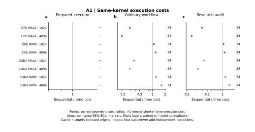

缓存每格4份预选输入，仅给描述性配对比，不生成区间；每输入初次及全部三次prepared调用均核验合格且计时齐全后才使用prepared中位数。普通工作流与含审计执行使用24次原始四链主任务的共同有效重复；至少20份时给逐点95% BCa区间，否则区间未定。点为共同合格输入上顺序/时间成本比的几何均值。RWM比较Online Picard，MALA比较quasi-DEER；缓存比不是普通后验推断加速。 空心标记表示区间不可判定；缺失点不补零。完整分母、缺失原因、参考类别及配对四格表见来源数据。

来源：[A1/ratios.csv](A1/ratios.csv)。

### A1 / standard_q1

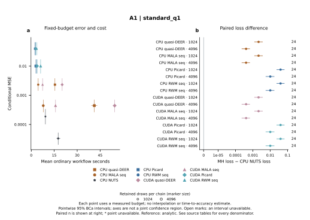

左图为各已测预算下的条件误差和同一函数可用重复上的普通成本。横纵区间分别为逐点95% BCa区间，不是联合置信区域。右图为共同有效重复上MH平方损失减CPU NUTS平方损失，零线不是显著性门槛。没有预算插值或精确达到精度时间的声明。 空心标记表示区间不可判定；缺失点不补零。完整分母、缺失原因、参考类别及配对四格表见来源数据。

来源：[A1/errors.csv](A1/errors.csv)。

### A1 / standard_q1_squared

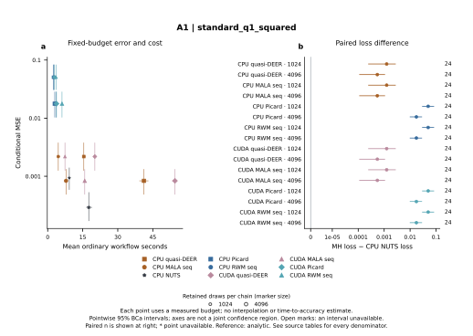

左图为各已测预算下的条件误差和同一函数可用重复上的普通成本。横纵区间分别为逐点95% BCa区间，不是联合置信区域。右图为共同有效重复上MH平方损失减CPU NUTS平方损失，零线不是显著性门槛。没有预算插值或精确达到精度时间的声明。 空心标记表示区间不可判定；缺失点不补零。完整分母、缺失原因、参考类别及配对四格表见来源数据。

来源：[A1/errors.csv](A1/errors.csv)。

### A1 / standard_q1_gt1

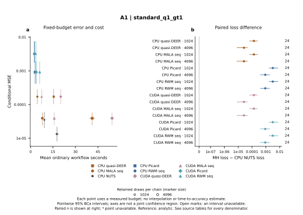

左图为各已测预算下的条件误差和同一函数可用重复上的普通成本。横纵区间分别为逐点95% BCa区间，不是联合置信区域。右图为共同有效重复上MH平方损失减CPU NUTS平方损失，零线不是显著性门槛。没有预算插值或精确达到精度时间的声明。 空心标记表示区间不可判定；缺失点不补零。完整分母、缺失原因、参考类别及配对四格表见来源数据。

来源：[A1/errors.csv](A1/errors.csv)。

### L1 / execution costs

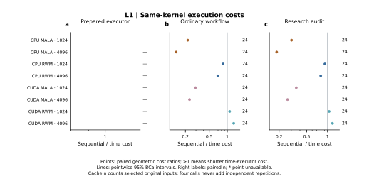

缓存每格4份预选输入，仅给描述性配对比，不生成区间；每输入初次及全部三次prepared调用均核验合格且计时齐全后才使用prepared中位数。普通工作流与含审计执行使用24次原始四链主任务的共同有效重复；至少20份时给逐点95% BCa区间，否则区间未定。点为共同合格输入上顺序/时间成本比的几何均值。RWM比较Online Picard，MALA比较quasi-DEER；缓存比不是普通后验推断加速。 空心标记表示区间不可判定；缺失点不补零。完整分母、缺失原因、参考类别及配对四格表见来源数据。

来源：[L1/ratios.csv](L1/ratios.csv)。

### L1 / q1

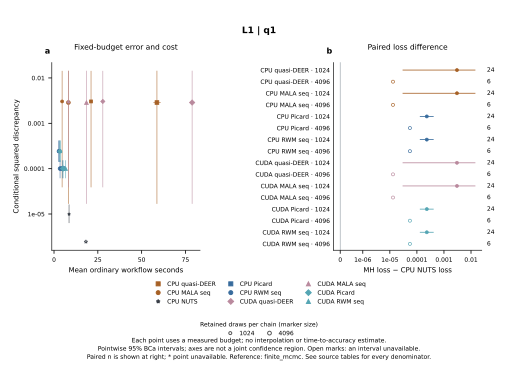

左图为各已测预算下的条件误差和同一函数可用重复上的普通成本。横纵区间分别为逐点95% BCa区间，不是联合置信区域。右图为共同有效重复上MH平方损失减CPU NUTS平方损失，零线不是显著性门槛。没有预算插值或精确达到精度时间的声明。 空心标记表示区间不可判定；缺失点不补零。完整分母、缺失原因、参考类别及配对四格表见来源数据。

来源：[L1/errors.csv](L1/errors.csv)。

### L1 / q2

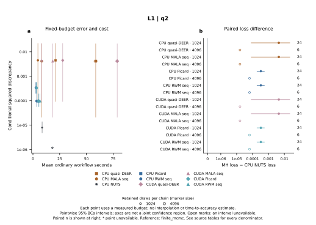

左图为各已测预算下的条件误差和同一函数可用重复上的普通成本。横纵区间分别为逐点95% BCa区间，不是联合置信区域。右图为共同有效重复上MH平方损失减CPU NUTS平方损失，零线不是显著性门槛。没有预算插值或精确达到精度时间的声明。 空心标记表示区间不可判定；缺失点不补零。完整分母、缺失原因、参考类别及配对四格表见来源数据。

来源：[L1/errors.csv](L1/errors.csv)。

### L1 / sigmoid_q1

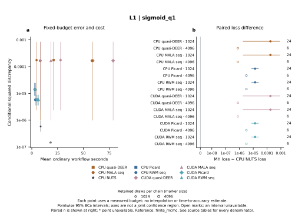

左图为各已测预算下的条件误差和同一函数可用重复上的普通成本。横纵区间分别为逐点95% BCa区间，不是联合置信区域。右图为共同有效重复上MH平方损失减CPU NUTS平方损失，零线不是显著性门槛。没有预算插值或精确达到精度时间的声明。 空心标记表示区间不可判定；缺失点不补零。完整分母、缺失原因、参考类别及配对四格表见来源数据。

来源：[L1/errors.csv](L1/errors.csv)。

### L1 / q1_positive

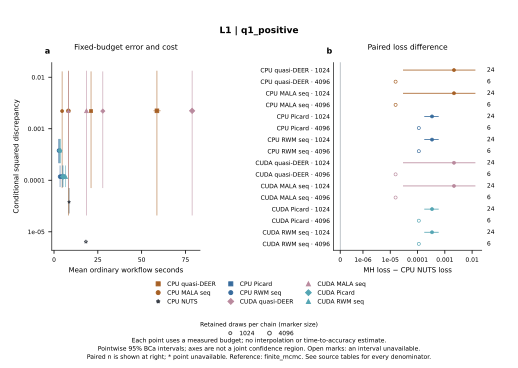

左图为各已测预算下的条件误差和同一函数可用重复上的普通成本。横纵区间分别为逐点95% BCa区间，不是联合置信区域。右图为共同有效重复上MH平方损失减CPU NUTS平方损失，零线不是显著性门槛。没有预算插值或精确达到精度时间的声明。 空心标记表示区间不可判定；缺失点不补零。完整分母、缺失原因、参考类别及配对四格表见来源数据。

来源：[L1/errors.csv](L1/errors.csv)。

### L2 / execution costs

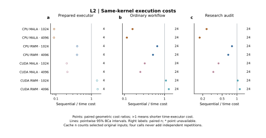

缓存每格4份预选输入，仅给描述性配对比，不生成区间；每输入初次及全部三次prepared调用均核验合格且计时齐全后才使用prepared中位数。普通工作流与含审计执行使用24次原始四链主任务的共同有效重复；至少20份时给逐点95% BCa区间，否则区间未定。点为共同合格输入上顺序/时间成本比的几何均值。RWM比较Online Picard，MALA比较quasi-DEER；缓存比不是普通后验推断加速。 空心标记表示区间不可判定；缺失点不补零。完整分母、缺失原因、参考类别及配对四格表见来源数据。

来源：[L2/ratios.csv](L2/ratios.csv)。

### L2 / q1

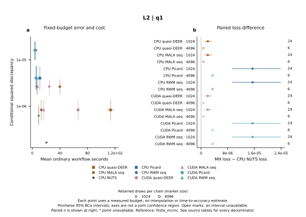

左图为各已测预算下的条件误差和同一函数可用重复上的普通成本。横纵区间分别为逐点95% BCa区间，不是联合置信区域。右图为共同有效重复上MH平方损失减CPU NUTS平方损失，零线不是显著性门槛。没有预算插值或精确达到精度时间的声明。 空心标记表示区间不可判定；缺失点不补零。完整分母、缺失原因、参考类别及配对四格表见来源数据。

来源：[L2/errors.csv](L2/errors.csv)。

### L2 / q2

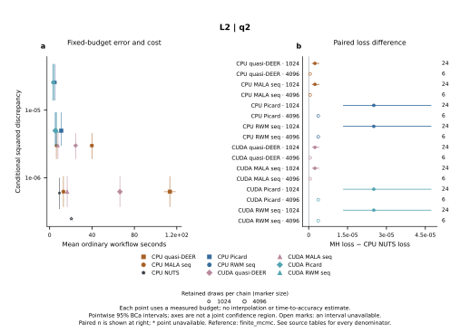

左图为各已测预算下的条件误差和同一函数可用重复上的普通成本。横纵区间分别为逐点95% BCa区间，不是联合置信区域。右图为共同有效重复上MH平方损失减CPU NUTS平方损失，零线不是显著性门槛。没有预算插值或精确达到精度时间的声明。 空心标记表示区间不可判定；缺失点不补零。完整分母、缺失原因、参考类别及配对四格表见来源数据。

来源：[L2/errors.csv](L2/errors.csv)。

### L2 / sigmoid_q1

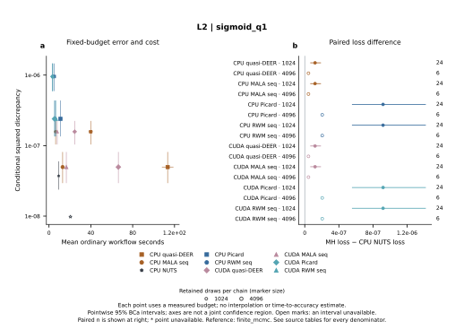

左图为各已测预算下的条件误差和同一函数可用重复上的普通成本。横纵区间分别为逐点95% BCa区间，不是联合置信区域。右图为共同有效重复上MH平方损失减CPU NUTS平方损失，零线不是显著性门槛。没有预算插值或精确达到精度时间的声明。 空心标记表示区间不可判定；缺失点不补零。完整分母、缺失原因、参考类别及配对四格表见来源数据。

来源：[L2/errors.csv](L2/errors.csv)。

### L2 / q1_positive

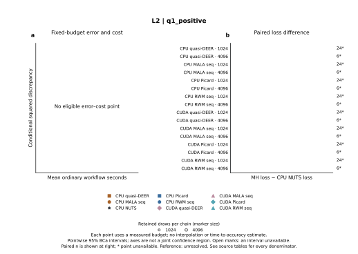

左图为各已测预算下的条件误差和同一函数可用重复上的普通成本。横纵区间分别为逐点95% BCa区间，不是联合置信区域。右图为共同有效重复上MH平方损失减CPU NUTS平方损失，零线不是显著性门槛。没有预算插值或精确达到精度时间的声明。 空心标记表示区间不可判定；缺失点不补零。完整分母、缺失原因、参考类别及配对四格表见来源数据。

来源：[L2/errors.csv](L2/errors.csv)。

### H1 / execution costs

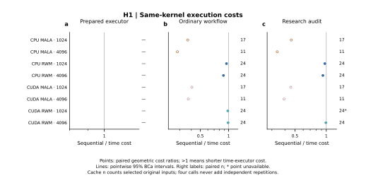

缓存每格4份预选输入，仅给描述性配对比，不生成区间；每输入初次及全部三次prepared调用均核验合格且计时齐全后才使用prepared中位数。普通工作流与含审计执行使用24次原始四链主任务的共同有效重复；至少20份时给逐点95% BCa区间，否则区间未定。点为共同合格输入上顺序/时间成本比的几何均值。RWM比较Online Picard，MALA比较quasi-DEER；缓存比不是普通后验推断加速。 空心标记表示区间不可判定；缺失点不补零。完整分母、缺失原因、参考类别及配对四格表见来源数据。

来源：[H1/ratios.csv](H1/ratios.csv)。

### H1 / v_over_3

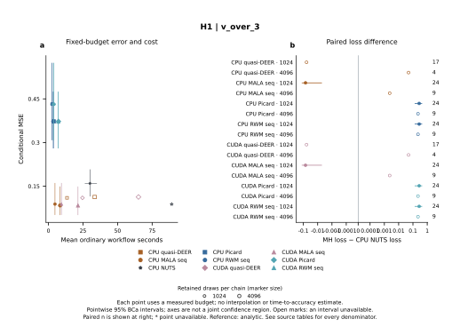

左图为各已测预算下的条件误差和同一函数可用重复上的普通成本。横纵区间分别为逐点95% BCa区间，不是联合置信区域。右图为共同有效重复上MH平方损失减CPU NUTS平方损失，零线不是显著性门槛。没有预算插值或精确达到精度时间的声明。 空心标记表示区间不可判定；缺失点不补零。完整分母、缺失原因、参考类别及配对四格表见来源数据。

来源：[H1/errors.csv](H1/errors.csv)。

### H1 / tanh_v_over_3

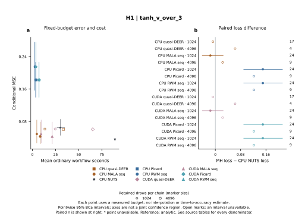

左图为各已测预算下的条件误差和同一函数可用重复上的普通成本。横纵区间分别为逐点95% BCa区间，不是联合置信区域。右图为共同有效重复上MH平方损失减CPU NUTS平方损失，零线不是显著性门槛。没有预算插值或精确达到精度时间的声明。 空心标记表示区间不可判定；缺失点不补零。完整分母、缺失原因、参考类别及配对四格表见来源数据。

来源：[H1/errors.csv](H1/errors.csv)。

### H1 / x1_positive

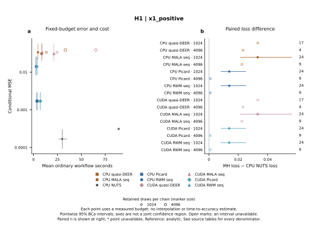

左图为各已测预算下的条件误差和同一函数可用重复上的普通成本。横纵区间分别为逐点95% BCa区间，不是联合置信区域。右图为共同有效重复上MH平方损失减CPU NUTS平方损失，零线不是显著性门槛。没有预算插值或精确达到精度时间的声明。 空心标记表示区间不可判定；缺失点不补零。完整分母、缺失原因、参考类别及配对四格表见来源数据。

来源：[H1/errors.csv](H1/errors.csv)。

### H1 / cos_z1

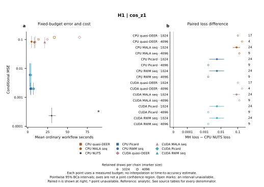

左图为各已测预算下的条件误差和同一函数可用重复上的普通成本。横纵区间分别为逐点95% BCa区间，不是联合置信区域。右图为共同有效重复上MH平方损失减CPU NUTS平方损失，零线不是显著性门槛。没有预算插值或精确达到精度时间的声明。 空心标记表示区间不可判定；缺失点不补零。完整分母、缺失原因、参考类别及配对四格表见来源数据。

来源：[H1/errors.csv](H1/errors.csv)。

### H2 / execution costs

缓存每格4份预选输入，仅给描述性配对比，不生成区间；每输入初次及全部三次prepared调用均核验合格且计时齐全后才使用prepared中位数。普通工作流与含审计执行使用24次原始四链主任务的共同有效重复；至少20份时给逐点95% BCa区间，否则区间未定。点为共同合格输入上顺序/时间成本比的几何均值。RWM比较Online Picard，MALA比较quasi-DEER；缓存比不是普通后验推断加速。 空心标记表示区间不可判定；缺失点不补零。完整分母、缺失原因、参考类别及配对四格表见来源数据。

来源：[H2/ratios.csv](H2/ratios.csv)。

### H2 / v_over_3

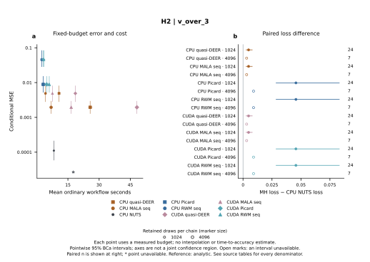

左图为各已测预算下的条件误差和同一函数可用重复上的普通成本。横纵区间分别为逐点95% BCa区间，不是联合置信区域。右图为共同有效重复上MH平方损失减CPU NUTS平方损失，零线不是显著性门槛。没有预算插值或精确达到精度时间的声明。 空心标记表示区间不可判定；缺失点不补零。完整分母、缺失原因、参考类别及配对四格表见来源数据。

来源：[H2/errors.csv](H2/errors.csv)。

### H2 / tanh_v_over_3

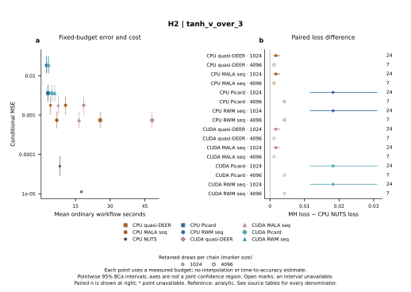

左图为各已测预算下的条件误差和同一函数可用重复上的普通成本。横纵区间分别为逐点95% BCa区间，不是联合置信区域。右图为共同有效重复上MH平方损失减CPU NUTS平方损失，零线不是显著性门槛。没有预算插值或精确达到精度时间的声明。 空心标记表示区间不可判定；缺失点不补零。完整分母、缺失原因、参考类别及配对四格表见来源数据。

来源：[H2/errors.csv](H2/errors.csv)。

### H2 / x1_positive

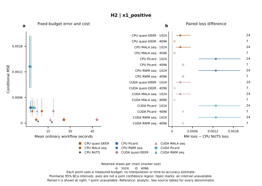

左图为各已测预算下的条件误差和同一函数可用重复上的普通成本。横纵区间分别为逐点95% BCa区间，不是联合置信区域。右图为共同有效重复上MH平方损失减CPU NUTS平方损失，零线不是显著性门槛。没有预算插值或精确达到精度时间的声明。 空心标记表示区间不可判定；缺失点不补零。完整分母、缺失原因、参考类别及配对四格表见来源数据。

来源：[H2/errors.csv](H2/errors.csv)。

### H2 / cos_z1

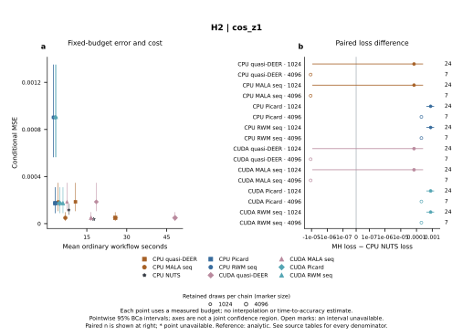

左图为各已测预算下的条件误差和同一函数可用重复上的普通成本。横纵区间分别为逐点95% BCa区间，不是联合置信区域。右图为共同有效重复上MH平方损失减CPU NUTS平方损失，零线不是显著性门槛。没有预算插值或精确达到精度时间的声明。 空心标记表示区间不可判定；缺失点不补零。完整分母、缺失原因、参考类别及配对四格表见来源数据。

来源：[H2/errors.csv](H2/errors.csv)。

### M1 / execution costs

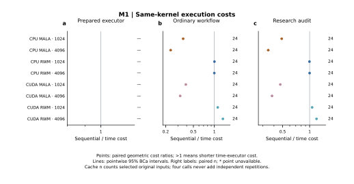

缓存每格4份预选输入，仅给描述性配对比，不生成区间；每输入初次及全部三次prepared调用均核验合格且计时齐全后才使用prepared中位数。普通工作流与含审计执行使用24次原始四链主任务的共同有效重复；至少20份时给逐点95% BCa区间，否则区间未定。点为共同合格输入上顺序/时间成本比的几何均值。RWM比较Online Picard，MALA比较quasi-DEER；缓存比不是普通后验推断加速。 空心标记表示区间不可判定；缺失点不补零。完整分母、缺失原因、参考类别及配对四格表见来源数据。

来源：[M1/ratios.csv](M1/ratios.csv)。

### M1 / standard_q1

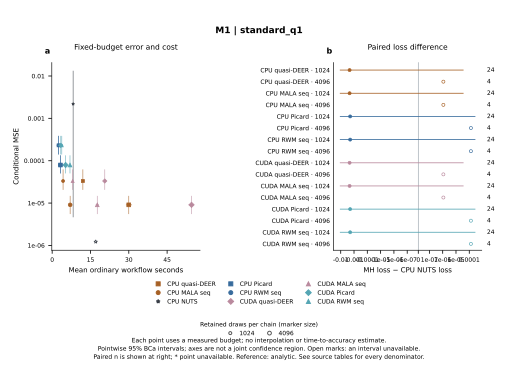

左图为各已测预算下的条件误差和同一函数可用重复上的普通成本。横纵区间分别为逐点95% BCa区间，不是联合置信区域。右图为共同有效重复上MH平方损失减CPU NUTS平方损失，零线不是显著性门槛。没有预算插值或精确达到精度时间的声明。 空心标记表示区间不可判定；缺失点不补零。完整分母、缺失原因、参考类别及配对四格表见来源数据。

来源：[M1/errors.csv](M1/errors.csv)。

### M1 / q1_positive

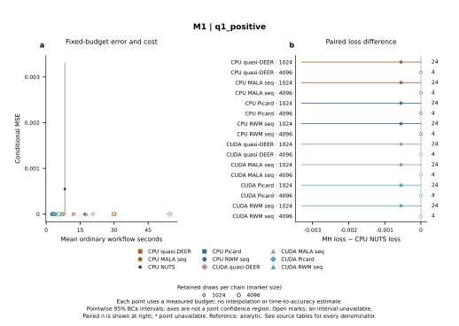

左图为各已测预算下的条件误差和同一函数可用重复上的普通成本。横纵区间分别为逐点95% BCa区间，不是联合置信区域。右图为共同有效重复上MH平方损失减CPU NUTS平方损失，零线不是显著性门槛。没有预算插值或精确达到精度时间的声明。 空心标记表示区间不可判定；缺失点不补零。完整分母、缺失原因、参考类别及配对四格表见来源数据。

来源：[M1/errors.csv](M1/errors.csv)。

### M1 / q2

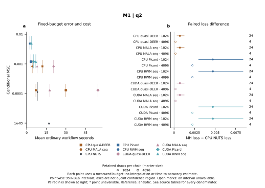

左图为各已测预算下的条件误差和同一函数可用重复上的普通成本。横纵区间分别为逐点95% BCa区间，不是联合置信区域。右图为共同有效重复上MH平方损失减CPU NUTS平方损失，零线不是显著性门槛。没有预算插值或精确达到精度时间的声明。 空心标记表示区间不可判定；缺失点不补零。完整分母、缺失原因、参考类别及配对四格表见来源数据。

来源：[M1/errors.csv](M1/errors.csv)。

### M1 / q2_squared

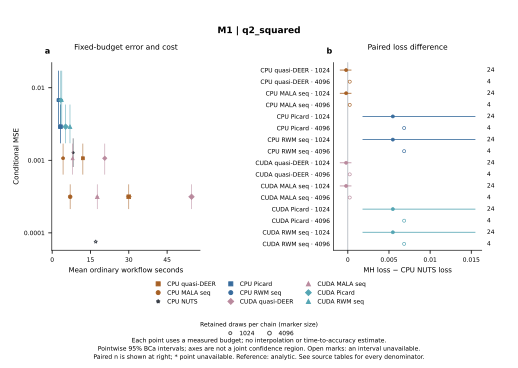

左图为各已测预算下的条件误差和同一函数可用重复上的普通成本。横纵区间分别为逐点95% BCa区间，不是联合置信区域。右图为共同有效重复上MH平方损失减CPU NUTS平方损失，零线不是显著性门槛。没有预算插值或精确达到精度时间的声明。 空心标记表示区间不可判定；缺失点不补零。完整分母、缺失原因、参考类别及配对四格表见来源数据。

来源：[M1/errors.csv](M1/errors.csv)。

### W1 / execution costs

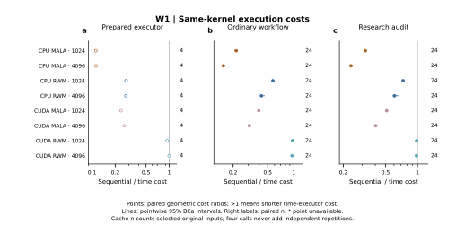

缓存每格4份预选输入，仅给描述性配对比，不生成区间；每输入初次及全部三次prepared调用均核验合格且计时齐全后才使用prepared中位数。普通工作流与含审计执行使用24次原始四链主任务的共同有效重复；至少20份时给逐点95% BCa区间，否则区间未定。点为共同合格输入上顺序/时间成本比的几何均值。RWM比较Online Picard，MALA比较quasi-DEER；缓存比不是普通后验推断加速。 空心标记表示区间不可判定；缺失点不补零。完整分母、缺失原因、参考类别及配对四格表见来源数据。

来源：[W1/ratios.csv](W1/ratios.csv)。

### W1 / alpha

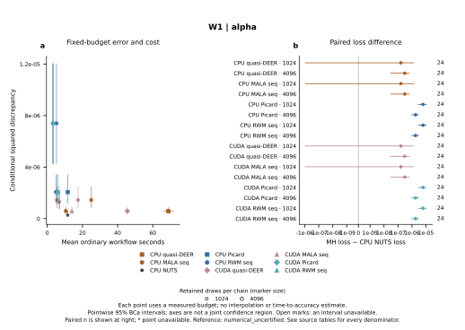

左图为各已测预算下的条件误差和同一函数可用重复上的普通成本。横纵区间分别为逐点95% BCa区间，不是联合置信区域。右图为共同有效重复上MH平方损失减CPU NUTS平方损失，零线不是显著性门槛。没有预算插值或精确达到精度时间的声明。 空心标记表示区间不可判定；缺失点不补零。完整分母、缺失原因、参考类别及配对四格表见来源数据。

来源：[W1/errors.csv](W1/errors.csv)。

### W1 / beta

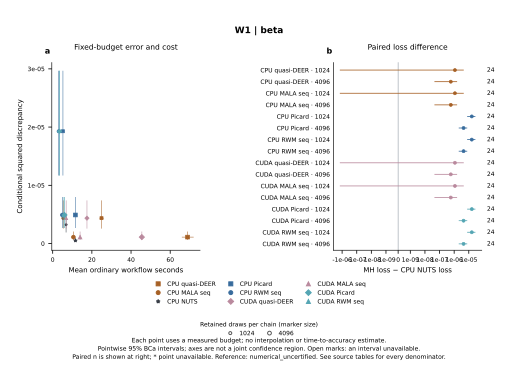

左图为各已测预算下的条件误差和同一函数可用重复上的普通成本。横纵区间分别为逐点95% BCa区间，不是联合置信区域。右图为共同有效重复上MH平方损失减CPU NUTS平方损失，零线不是显著性门槛。没有预算插值或精确达到精度时间的声明。 空心标记表示区间不可判定；缺失点不补零。完整分母、缺失原因、参考类别及配对四格表见来源数据。

来源：[W1/errors.csv](W1/errors.csv)。

### W1 / alpha_squared

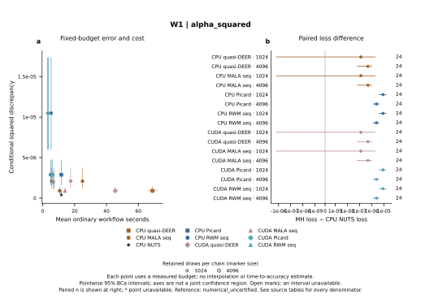

左图为各已测预算下的条件误差和同一函数可用重复上的普通成本。横纵区间分别为逐点95% BCa区间，不是联合置信区域。右图为共同有效重复上MH平方损失减CPU NUTS平方损失，零线不是显著性门槛。没有预算插值或精确达到精度时间的声明。 空心标记表示区间不可判定；缺失点不补零。完整分母、缺失原因、参考类别及配对四格表见来源数据。

来源：[W1/errors.csv](W1/errors.csv)。

### W1 / beta_squared

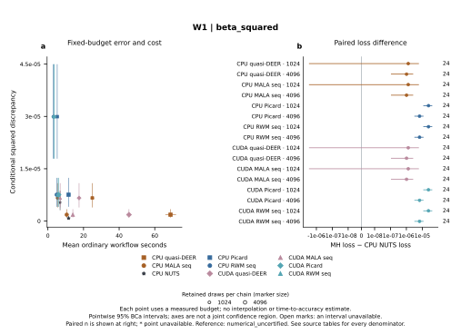

左图为各已测预算下的条件误差和同一函数可用重复上的普通成本。横纵区间分别为逐点95% BCa区间，不是联合置信区域。右图为共同有效重复上MH平方损失减CPU NUTS平方损失，零线不是显著性门槛。没有预算插值或精确达到精度时间的声明。 空心标记表示区间不可判定；缺失点不补零。完整分母、缺失原因、参考类别及配对四格表见来源数据。

来源：[W1/errors.csv](W1/errors.csv)。

### W1 / p_switch_0m

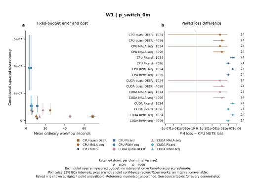

左图为各已测预算下的条件误差和同一函数可用重复上的普通成本。横纵区间分别为逐点95% BCa区间，不是联合置信区域。右图为共同有效重复上MH平方损失减CPU NUTS平方损失，零线不是显著性门槛。没有预算插值或精确达到精度时间的声明。 空心标记表示区间不可判定；缺失点不补零。完整分母、缺失原因、参考类别及配对四格表见来源数据。

来源：[W1/errors.csv](W1/errors.csv)。

### W1 / p_switch_100m

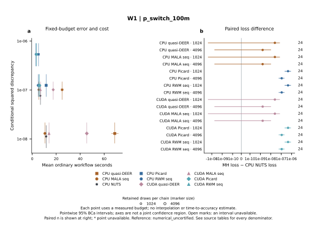

左图为各已测预算下的条件误差和同一函数可用重复上的普通成本。横纵区间分别为逐点95% BCa区间，不是联合置信区域。右图为共同有效重复上MH平方损失减CPU NUTS平方损失，零线不是显著性门槛。没有预算插值或精确达到精度时间的声明。 空心标记表示区间不可判定；缺失点不补零。完整分母、缺失原因、参考类别及配对四格表见来源数据。

来源：[W1/errors.csv](W1/errors.csv)。

### W1 / beta_positive

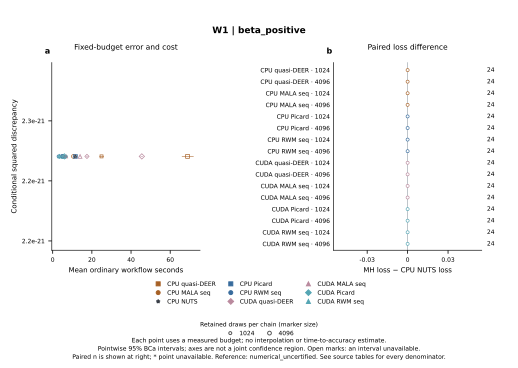

左图为各已测预算下的条件误差和同一函数可用重复上的普通成本。横纵区间分别为逐点95% BCa区间，不是联合置信区域。右图为共同有效重复上MH平方损失减CPU NUTS平方损失，零线不是显著性门槛。没有预算插值或精确达到精度时间的声明。 空心标记表示区间不可判定；缺失点不补零。完整分母、缺失原因、参考类别及配对四格表见来源数据。

来源：[W1/errors.csv](W1/errors.csv)。

## 仍须核验

原始结果、冻结协议与执行环境的审计属于上游接收步骤。本报告不能代替实际Windows验收、正式实验、完整研究复现或作者审阅。
每次改变绘图数据或布局后，须重做最终PDF字体、碰撞与逐面板检查。相关检查不是统计正确性的证明。
